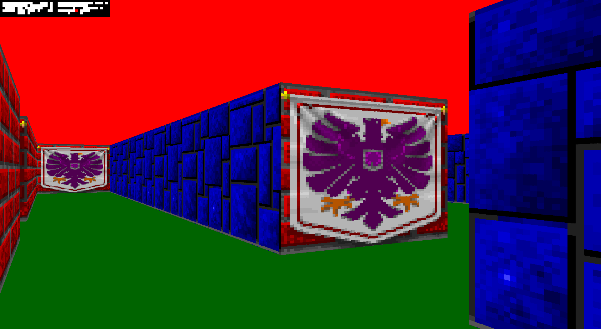
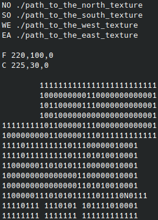
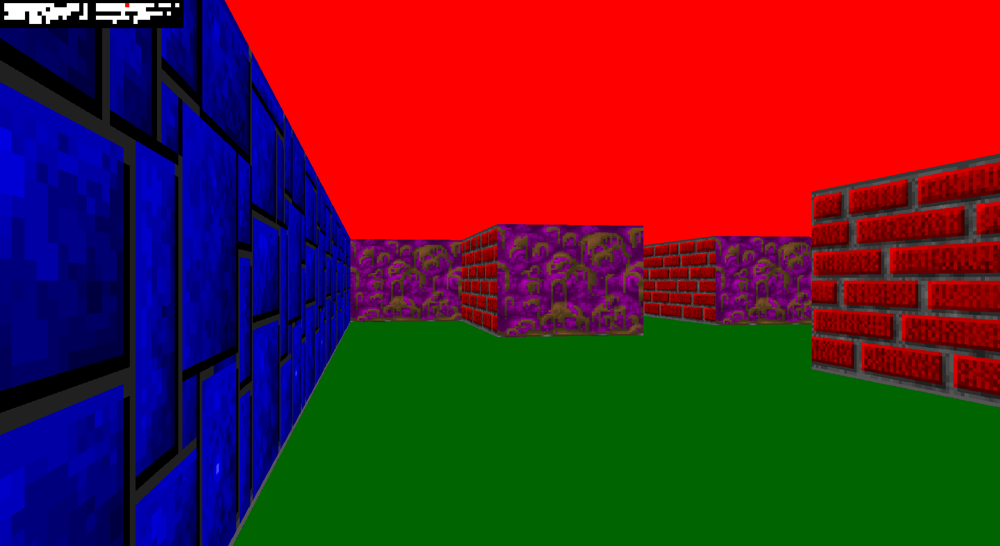
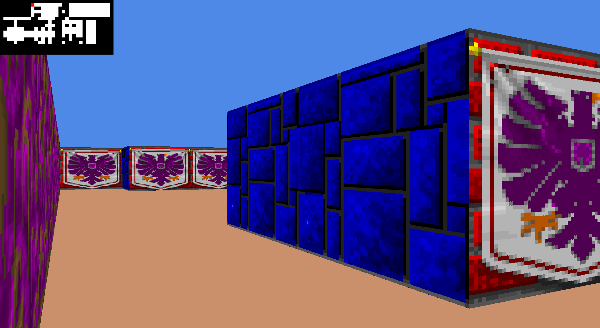
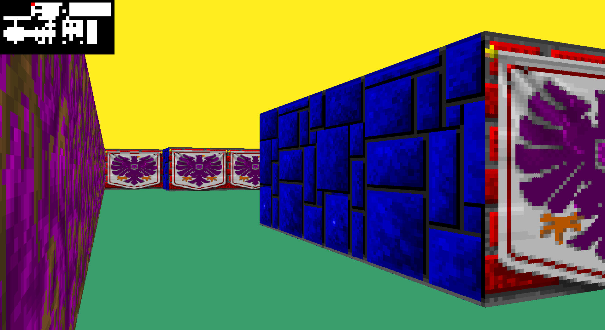

# Cub3D



## Description

Cub3D is a first-person view, 3D video game. The goal is to create a video game where the player can move in a 3D map.

An internal graphical library from Ecole 42 is provided to interface with the X server.

In particular, the program must read an input map in 2D and render it in 3D, using tilesets to create the gameplay.

Key features include:
- reading and checking input maps and tilesets
- using the raycasting technique to compute the distance to the walls and determine their dimensions to make the 3D view realistic
- display a 2D minimap on the screen to locate the player in the game
- handling keyboard and mouse events to play the video game

The project is entirely coded in C language with limited standard library function usage, and uses a Makefile to build the program.

Special care is given to program error management and avoiding memory leaks at all times.

The project is implemented according to Ecole 42's code norm: https://github.com/42School/norminette/tree/a9e1a3dde004b4f997194b3594292a7ee6eb49b3.

## Requirements

Following packages:
- gcc
- git
- make
- xorg
- libxext-dev
- libbsd-dev

## Build the project

The project requires interfacing with the X windowing system, therefore it needs to be run in a Linux operating system (using a virtual machine if necessary).

First, install the packages from the requirements section, then build the project:
```
git clone https://github.com/rchanrenous/42_projects.git 42_projects
cd cub3D
make
```

## Usage

The program takes as input a .cub file which contains the information about the map, the tilesets, and the floor and ceiling colors.

The map is composed of '1s' for the walls, '0s' for empty spaces, and 'N'/'S'/'E'/W for the initial position of the player and its direction (North, South, East, or West). The map must be closed, that is, surrounded by '1s'.

The tilesets are .xpm files.

Finally, the floor and ceiling colors are in RGB format (3 integers between 0 and 255).



The generic command to launch the game is:
```
./cub3D /path/to/.cub
```

The game uses the 'W', 'A', 'S', 'D' keys to move (use 'Z', 'Q', 'S', 'D' keys on AZERTY keyboards). The left and right arrows from the keyboard makes the player rotate to look left or right.

The game window can be moved, minimized and closed using the mouse. The ESC key can also be used to close the game.

## Examples

The `map/` directory contains a couple of maps:
```
./cub3D maps/mapE2.cub
./cub3D maps/game.cub
```




They can easily be adapted by modifiying the .cub files with tiles from the `textures/` directory, creating your own map, changing the floor and ceiling colors.




