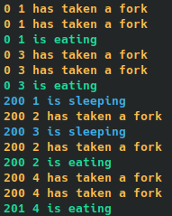

# Philosophers

## Description

Philosophers is a project inspired by the philosophers' problem, where philosophers are seated around a table to have lunch, but have to take turns to eat because there isn't enough forks for everybody. In particular, there is a fork between each philosopher at the table, and it takes two forks to be able to eat.

The philosophers are either in one of three states: eating, sleeping or thinking. Philosophers can eat if their left and right forks are available simulateanously ; they keep them to themselves until they are done eating, and go to sleep. Once they have slept long enough, they start thinking until they can eat again. A philosopher dies if they haven't finished eating since their last lunch for a given amount of time. 

The goal of this project is to simulate scenarios with given number of philosophers, time to eat and time to sleep. The simulations end when a philosopher starves, or if a number of times the philosophers have to eat is specified and is reached for each philosopher.

This project teaches about threading and memory access control.

Key features include: 
- runnning as many threads as there are philosophers to mimic the philosophers' interactions
- defining shared memory between the threads to represent the forks, by using mutex variables
- defining critical sections where the shared memory can only be accessed one thread at a time 

The project is entirely coded in C language with limited standard library function usage, and uses a Makefile to build the program.

Special care is given to program error management and avoiding memory leaks at all times.

The project is implemented according to Ecole 42's code norm: https://github.com/42School/norminette/tree/a9e1a3dde004b4f997194b3594292a7ee6eb49b3.

## Requirements

Following packages:
- gcc
- git
- make

## Usage

## Usage

The program can either be built locally or run in a Docker container.

### Build locally

First, install docker and the packages from the requirements section, then build the project:
```
git clone https://github.com/rchanrenous/42_projects.git 42_projects
cd philosophers
make
```

### Use the Docker container

Run the container by building locally the Docker image:
```
docker build -t philosophers .
docker run  -d -ti philosophers
```
or by pulling the image from DockerHub:
```
docker pull rchanrenous/philosophers:latest
docker run -d -ti rchanrenous/philosophers:latest
```
Open a bash terminal in the container:
```
docker run -d -ti philosophers --name docker_philosophers # run the container in detached mode
docker exec -ti docker_philosophers bash # open a terminal in the container
```

When finished, stop the container:
```
docker stop docker_philosophers
docker rm docker_philosophers
```

### Examples

The generic command to start a simulation is:
```
./philo number_of_philosophers time_to_die time_to_eat time_to_sleep
[number_of_times_each_philosopher_must_eat]
```
where each parameter is in milliseconds.

Each philosopher is identified by an integer between 1 and number_of_philosophers, and the program outputs each new action (eating, sleeping, thinking) taken by a philosopher, starting by the timestamp of the simulation (in ms). 

For instance:
```
./philo 4 410 200 200 1
```
will output:



The following visualizer can be very useful to interpret the program output: https://nafuka11.github.io/philosophers-visualizer/ (credit to https://github.com/nafuka11/philosophers-visualizer).

It suffices to copy and paste the output in the web page to get a neat visualisation.

The following examples illustrate different scenarios:
```
./philo 4 399 200 200 # insufficient time for a second eating round
./philo 4 400 200 200 # limited time margin for a second eating round (thread synchronization)
./philo 4 410 200 200 # simulation ends up finishing after 5 min because of synchronization delays
./philo 5 650 200 200 10 # odd number of philosophers, there is execution time randomness due to fork locking 
```


