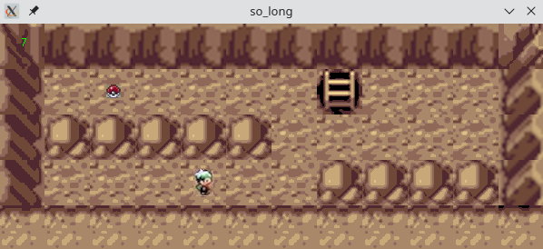
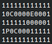
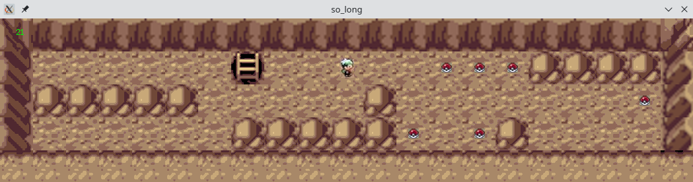
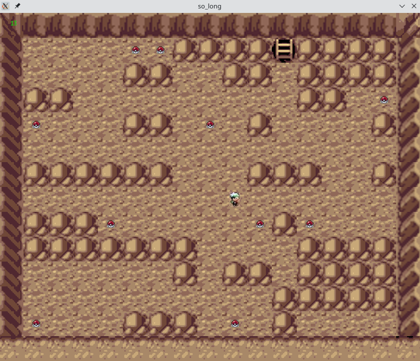

# So\_long 



## Description

So\_long is a graphical project where the goal is to create a 2D video game.

It is a basic game that consists of a character that needs to collect all the objects and get to the exit to end the game.
The program must display the game on the screen and animate it.

An internal graphical library from Ecole 42 is provided to interface with the X server.

Key features include:
- reading and checking input maps to create the gameplay
- handling keyboard and mouse events to play the video game

The project is entirely coded in C language with limited standard library function usage, and uses a Makefile to build the program.

Special care is given to program error management and avoiding memory leaks at all times.

The project is implemented according to Ecole 42's code norm: https://github.com/42School/norminette/tree/a9e1a3dde004b4f997194b3594292a7ee6eb49b3.

## Requirements

Following packages:
- gcc
- git
- make
- xorg
- libxext-dev
- libbsd-dev

## Build the project

The program can either be built locally using the source files or run in a Docker container.

### Build locally

First, install the packages from the requirements section, then build the project:
```
git clone https://github.com/rchanrenous/42_projects.git 42_projects
cd so_long
make
```

### Use the Docker container

First, install and run Docker.

Run the container by building locally the Docker image:
```
docker build -t so_long .
docker run -d -ti so_long
```
or by pulling the image from DockerHub:
```
docker pull rchanrenous/so_long:latest
docker run -d -ti rchanrenous/so_long:latest
```
Open a bash terminal in the container:
```
docker run -d -ti so_long --name docker_so_long # run the container in detached mode
docker exec -ti docker_so_long bash # open a terminal in the container
```
Then you can type in the terminal any command as in the Examples section.

When finished, stop the container:
```
docker stop docker_so_long
docker rm docker_so_long
```

## Usage

The program takes as input a .ber file which represents the map. The map file is a text file, where walls and obstacles are represented by a '1', empty spaces by a '0', objects by a 'C', the exit by an 'E', and the initial position of the character by a 'P'.

The map file must be rectangular and closed, that is, surrounded by '1s'. A valid path to finish the game must exist for the map to be valid.



The generic command to launch the game is:
```
./so_long /path/to/.ber
```

The game uses the 'W', 'A', 'S', 'D' keys to move (use 'Z', 'Q', 'S', 'D' keys on AZERTY keyboards). The game window can be moved, minimized and closed using the mouse. The ESC key can also be used to close the game.

### Examples

The `map/` directory contains a couple of maps:
```
./so_long maps/map.ber
./so_long maps/map2.ber
./so_long maps/map3.ber
```


